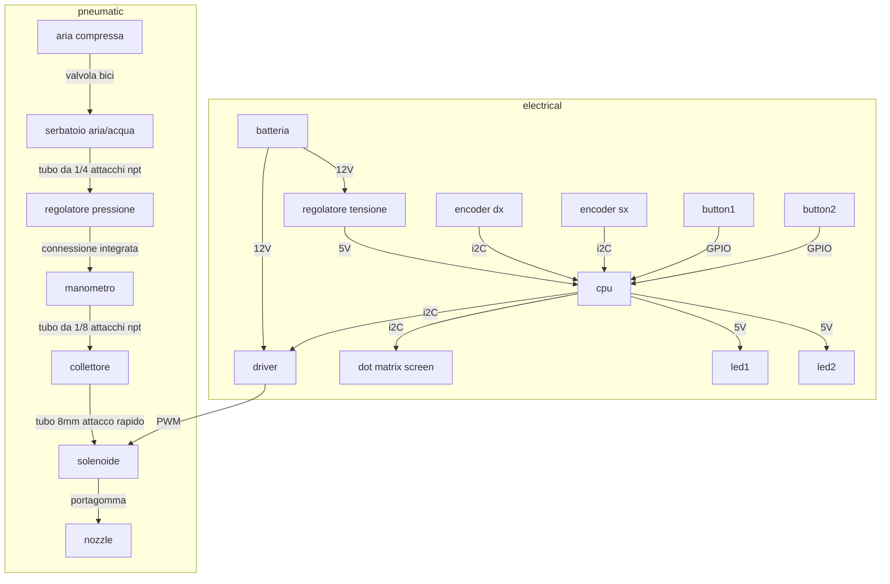

# bicisciaspruzzo

## Project description

The project is a bicycle that can print text on the ground. The system uses a series of irrigation nozzles to spray liquid on the ground while the bike is moving. The liquid can be water, paint, or any other liquid that can be sprayed (more details on [What can be sprayed](#what-can-be-sprayed) section).

It is born as a project for the [Ciemmona]() event, a bike ride/parade in the city of Genova, Italy, where the goal is to have a bike, equipped with several computer controlled spray nozzles, capable of receiving text via wifi and printing it on the ground while riding. It implements some kind of user interface to give the user some feedback on the status of the machine and to give him control to functionalities such as: a way to pause the printing process, to power cycle the system, or a way to control few parameters of the system such as the timing and speed of the solenoids actuation or the print process.
It should be functional and fairly safe to use

## How to use this document

This document is a work in progress. It is currently divided into 2 main sections.

[Modules](#modules) is the section describing the modules composing the system;

[Appendix](#appendix) is the section where things can be discussed / kept.

The modules are the main components of the system. Each module is described in detail in its own md file. It should be linked in this document.

## File structure

```
├── bikelangelo/ // stl folder
├── code/
│   ├── data/ // spiffs folder
|   |    └── index.html // the main UI
│   └── code.ino // the main code
├── tools/ // needed for spiffs
│   └── ESP32FS/
|       └── tool/
|           └── esp32fs.jar
├── airwater-tank.md // tank module docs
├── bikegif.gif // bikelangelo animation
├── bikelangeloBT.ino // original bikelangelo code
├── codeReadme.md // software documentation
├── esquema_bb.jpg // bikelangelo diagram
├── nozzle.md // nozzle module docs
├── pic.JPG // bikelangelo portrait
├── README.md // this file
├── speeddir-sensor.md // speed sensor module docs
├── template-module.md // template for modules docs
```

## Table of contents

 In the current state of the documentation, some entries may not be actually there yet.

- [Project description](#project-description)
- [How to use this document](#how-to-use-this-document)
- [Software documentation](./codeReadme.md)
- [Modules](#modules)
- [Appendix](#appendix)
  - [What can be sprayed](#what-can-be-sprayed)
  - [project name](#project-name)

------

## Modules

 - [Module Template](./template-module.md) // use this to start with a new module
  - [Air/water tank](airwater-tank.md)
  - [Pressure regulator](#pressure-regulator)
  - [Manometer](#manometer)
  - [Manifold](#manifold)
  - [Solenoid](#solenoid)
  - [Nozzle](./nozzle.md)
  - [Purge system](#purge-system)
  - [Speed and direction sensor](./speeddir-sensor.md)


## Appendix

### What can be sprayed

The system is designed to spray liquids that:

- can be easily atomized
- are not corrosive to the components of the idraulic system
- are compatible with the pressure of the system
- are not too thick

Such liquids are:

- water

Liquids that leave or can leave a residue inside the system like paint, glue, etc. are not recommended unless a [purge system](#purge-system) is implemented. The purge system is a system that uses a liquid to clean the system after use. It is not mandatory, but it is recommended to use it if the liquid can leave a residue inside the system.

### Project name

The project is a fork of [bikeangelo](http://TODO) project. We currently use the name *bicisciaspruzzo* but maybe there is better name. The name should be catchy and easy to remember. It should also be related to the project and its purpose.

Some ideas are:

> **SPLASHD**

- Street Printer Laying Aqueos solutions Human Driven
- Street Printer Laying Aqueos Statements Human Driven
- Street Printer Lettering And Spraying Human Driven

> **SPLASH**

- Street Printer Lettering And Spraying H2O

> **SPLASHING**

- Street Printer Lettering And Spraying Human Involved Needs Graffiti
- Street Printer Lettering And Spraying Human Involved Next Generation

### graph draft

This is a temporary schematic diagram of the system. It is not complete and serves also as a reference for mermaid syntax. It is not a complete schematic of the system, but it shows some of the main components and their connections.

